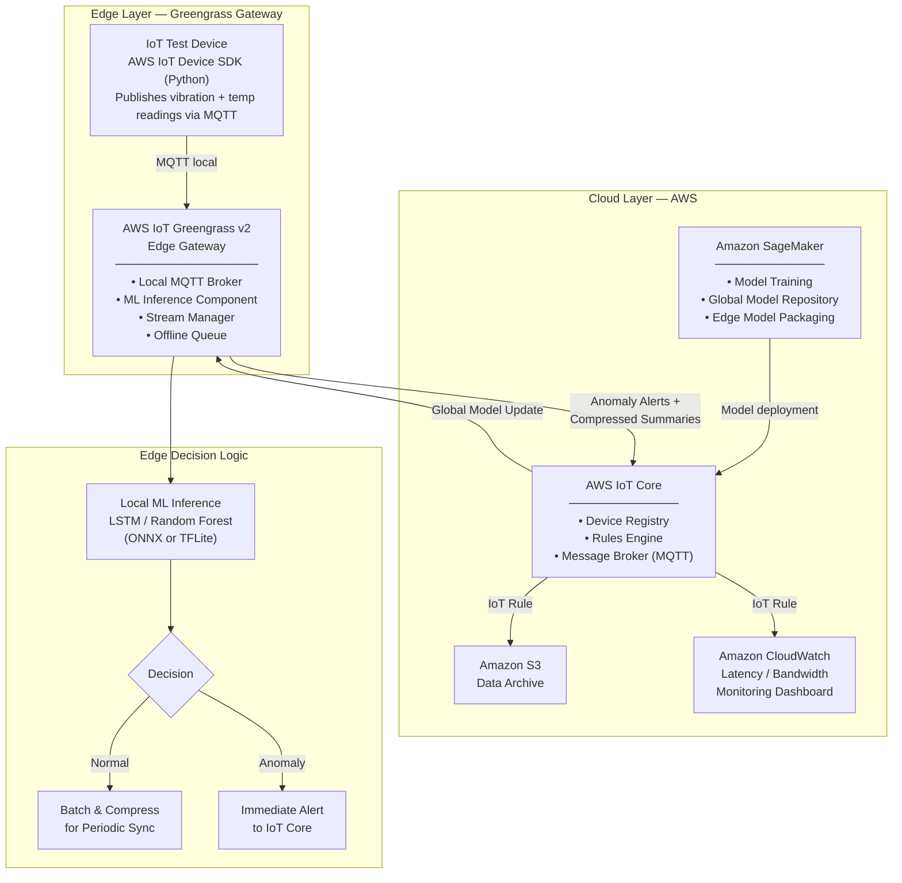

# Hybrid Cloud-Edge Architecture

## Architecture Decision

**Chosen Stack:** AWS IoT Device SDK (Python test device) + AWS IoT Greengrass v2 (edge gateway + ML inference) + AWS IoT Core (cloud broker) + AWS CloudWatch (monitoring)

**Rationale for AWS IoT Device SDK (Python):** A Python client using the AWS IoT Device SDK connects to Greengrass (Configuration B) or directly to IoT Core (Configuration A) via MQTT, replicating real device communication behaviour without requiring physical hardware. This is the standard AWS-recommended approach for testing IoT pipelines.

**No external toolchain required:** The entire stack runs within the AWS ecosystem. Performance measurements come directly from real CloudWatch metrics and Greengrass component logs on live infrastructure.

---

## Architecture Diagram (Mermaid)



---

## Component Responsibilities

### Edge Layer

| Component | Role |
|---|---|
| IoT Test Device (AWS Device SDK) | Publishes vibration + temperature readings to Greengrass via MQTT |
| Greengrass v2 Nucleus | Core runtime managing component lifecycle on edge device |
| Local MQTT Broker (Moquette) | Receives device data without requiring cloud connectivity |
| ML Inference Component | Runs ONNX/TFLite model locally; produces normal/anomaly decisions |
| Stream Manager | Batches normal readings, compresses, and forwards to cloud on schedule |
| Offline Queue | Stores alerts and summaries during cloud disconnection; syncs on reconnect |

### Cloud Layer

| Component | Role |
|---|---|
| AWS IoT Core | MQTT broker receiving only anomaly alerts and batched summaries from edge |
| Rules Engine | Routes messages to S3 (storage) and CloudWatch (monitoring) |
| Amazon S3 | Archives all received data for long-term analysis |
| Amazon CloudWatch | Monitors latency, bandwidth (BytesIn), message count, inference metrics |
| Amazon SageMaker | Trains global ML model; packages it for edge deployment via IoT Core |

---

## Data Flow — Configuration A vs Configuration B

### Configuration A: Cloud-Only Baseline
```
IoT Device → AWS IoT Core (direct MQTT) → Cloud ML Inference → Decision
             [100% raw data forwarded]    [300–800ms round trip]
```

### Configuration B: Hybrid Edge (Proposed)
```
IoT Device → Greengrass (local MQTT) → Edge ML Inference → Decision (<100ms)
                                              ↓
                                 [Anomaly Alert] → IoT Core (immediate)
                                 [Normal batch]  → IoT Core (periodic, compressed)
```

---

## Deployment Configuration

| Parameter | Value |
|---|---|
| Edge gateway | Local machine or EC2 instance running Greengrass v2 |
| Test device connection | AWS IoT Device SDK (Python), MQTT over TLS port 8883 |
| Measurement window per configuration | 30 minutes of live device data |
| Cloud disconnection test duration | 5 minutes (outbound traffic blocked via firewall rule) |
| ML model | LSTM (sequence length: 30 readings) or Random Forest |
| Model format for edge | ONNX or TFLite |
| Dataset for training | NASA CMAPSS FD001 subset |
| Monitoring tool | AWS CloudWatch (latency, BytesIn, message count, inference time) |
